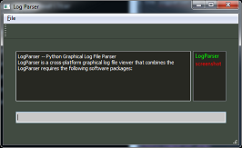

LogParser -- Python Graphical Log File Parser
============================================================

LogParser is a cross-platform graphical log file viewer that combines the
advantages of the Linux command-line tools *less* and *grep* in an easy-to-use
package that is usable by mere mortals who are not regular expression masters.

It allows the user to create inclusion and exclusion filters and to combine them
using boolean AND and OR logic.

Inclusion filters are shown in green and exclusion filters are shown in red.

Prerequisites
-------------

LogParser requires the following software packages:

  * Python    - Either Python 2.7 or 3.x (currently tested on 2.7 and 3.5)
  * Qt4       - Qt4 shared libraries
  * PyQt4     - Python bindings for Qt4

Installation
------------

No installation required.

Using
-----
The only file needed is the executable Python script, "logparser.py".  You can execute it
with no arguments to open it without a file to start:

    $ python logparser.py

In this case you will need to drag-and-drop a file onto the logparser.py GUI
using a graphical file browser.

You can also pass it a filename to open on the command line:

    $ python logparser.py [log_file_name.ext]

Screenshot
----------  

The following screenshot shows this README.md file with a "LogParser" inclusion
filter and a "screenshot" exclusion filter. Inclusion filters are displayed in the right
pane in green, while exclusion filters are displayed in red.

Goals
-----

* Cross-platform (working on Windows, Mac OS X, and Linux)
* Easy to use (don't need to know regular expressions)
* Work with any log file (not specific to any format)

Similar tools
-------------

Depending on your needs, you may wish to check out one of these tools which
are all more mature than this one, but have different advantages/disadvantages:

   * [lnav](http://lnav.org/)
       * If your log file format is supported this has some awesome advanced features
   * [glogg](http://glogg.bonnefon.org/)
       * If you know regular expressions, this is a great tool
   * [Log Parser 2.2](https://technet.microsoft.com/en-us/scriptcenter/dd919274.aspx)
       * If you only work on Windows, this is pretty powerful
